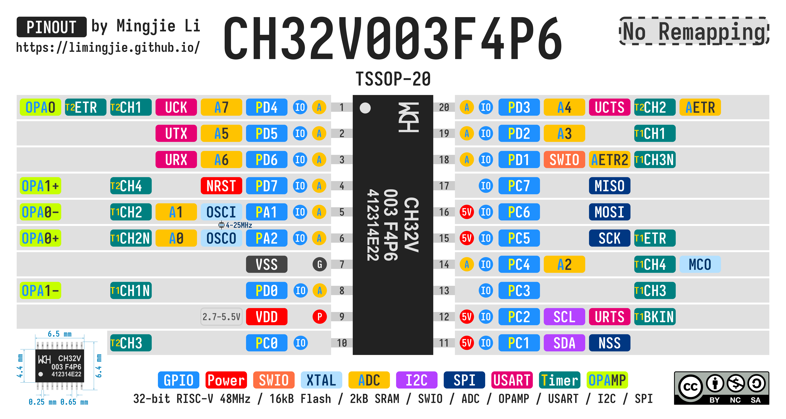

# CH32V003 3-Digit Segment LCD Driver

The solution provides an efficient segment LCD driver for the low-cost CH32V003 microcontroller, capable of driving a TN Positive 3-digit LCD panel using minimal hardware resources and optimized firmware.


- [CH32V003 3-Digit Segment LCD Driver](#ch32v003-3-digit-segment-lcd-driver)
  - [LCD Control Theory](#lcd-control-theory)
    - [LCD Multiplex](#lcd-multiplex)
    - [LCD Driver Signal and Timing](#lcd-driver-signal-and-timing)
  - [CH32V003 Implementation](#ch32v003-implementation)
    - [Circuit Design and Schematic](#circuit-design-and-schematic)
    - [Character Encoding and Mapping](#character-encoding-and-mapping)
    - [Driver Logic](#driver-logic)
  - [7-Segment Display Characters](#7-segment-display-characters)
  - [Hardware](#hardware)
    - [MCU - CH32V003](#mcu---ch32v003)
    - [TN Positive 3-Digit Segment LCD Panel](#tn-positive-3-digit-segment-lcd-panel)
      - [Specifications](#specifications)
  - [References](#references)
  - [License](#license)

## LCD Control Theory

### LCD Multiplex


- Each Common pin controls 1 or 2 segments across 3 characters.
  - **`Common Pin 1`** - **`D`** segments.
  - **`Common Pin 2`** - **`E`** and **`C`** segments.
  - **`Common Pin 3`** - **`G`** and **`B`** segments.
  - **`Common Pin 4`** - **`F`** and **`A`** segments.
- Each Segment pin controls 3 or 4 segments within 1 character.
  - **`D1`** - **`Segment Pin 6`** (**`D`** **`E`** **`G`** **`F`**) and **`Segment Pin 5`** (**`C`** **`B`** **`A`**).
  - **`D2`** - **`Segment Pin 4`** (**`D`** **`E`** **`G`** **`F`**) and **`Segment Pin 3`** (**`C`** **`B`** **`A`**).
  - **`D3`** - **`Segment Pin 2`** (**`D`** **`E`** **`G`** **`F`**) and **`Segment Pin 1`** (**`C`** **`B`** **`A`**).

The wiring diagram of the LCD display (from [Pacific Display](https://www.pacificdisplay.com/lcd_multiplex_drive.htm)).


### LCD Driver Signal and Timing

LCDs use AC signals to prevent damage and ensure longevity by avoiding DC-induced charge accumulation, which can permanently polarize and degrade liquid crystal molecules.

For a `1/2` bias LCD, the Common pins require 3 voltages: `+V`, `+V/2`, and `0`. Use the following timing sequence to ensure the average voltage across the LCD is `0`.

The matrix below shows the voltage difference `SEG - COM` for all possible voltage combinations. The LCD segment is lit when the voltage difference is exactly `±V`.

- LCD segments are **Lit** when `SEG - COM = ±V` for `1/4` duty cycle.
- The voltage difference alternates between positive and negative to maintain AC operation

| **COM Voltages**                | **`0` / `LOW`** | **`+V/2` / `FLOAT`** | **`+V`/`HIGH`** |
| :------------------------------ | --------------: | -------------------: | --------------: |
| **SEG Voltage =  `0` / `LOW`**  |             `0` |               `-V/2` |  (**Lit**) `-V` |
| **SEG Voltage = `+V` / `HIGH`** |  (**Lit**) `+V` |               `+V/2` |             `0` |


## CH32V003 Implementation

### Circuit Design and Schematic

Each Common pin of the LCD is connected to an external voltage divider circuit. When the corresponding GPIO is set to floating input mode, the external voltage divider maintains the Common pin at `+V/2`.


### Character Encoding and Mapping

To simplify the 7-segment character to LCD multiplex conversion, the 7-segment character is encoded in **`0b D EC GB FA`**. Actually, any bit order works, keeping **`EC`** **`GB`** **`FA`** groups could simplify the bit operations.

Use the following code to calculate the segment values for each Common pin.

```C
// Convert Character Bit Order (0bDECGBFA) to Segment Masks for Each Common Pin
//                         LCD Char | Seg Group Mask   | <<Shifts>>
//                         D1 D2 D3 | 0bDECGBFA        | D1  D2  D3
// Segment Mask for COM1 - D_ D_ D_ - 0b1000000 / 0x40 - >>1 >>3 >>5
// Segment Mask for COM2 - EC EC EC - 0b0110000 / 0x30 -     >>2 >>4
// Segment Mask for COM3 - GB GB GB - 0b0001100 / 0x0C - <<2     >>2
// Segment Mask for COM4 - FA FA FA - 0b0000011 / 0x03 - <<4 <<2
//              Segments - 65 43 21
seg_masks[0] = ((d1_segs & 0x40) >> 1) | ((d2_segs & 0x40) >> 3) | ((d3_segs & 0x40) >> 5);  // COM1: D  bits
seg_masks[1] = ((d1_segs & 0x30) >> 0) | ((d2_segs & 0x30) >> 2) | ((d3_segs & 0x30) >> 4);  // COM2: EC bits
seg_masks[2] = ((d1_segs & 0x0C) << 2) | ((d2_segs & 0x0C) >> 0) | ((d3_segs & 0x0C) >> 2);  // COM3: GB bits
seg_masks[3] = ((d1_segs & 0x03) << 4) | ((d2_segs & 0x03) << 2) | ((d3_segs & 0x03) >> 0);  // COM4: FA bits
```

Instead of setting each pin individually, the segment values can be directly assigned to the entire GPIO port for more efficient operation.

```C
// BSHR upper 16 bits: Reset pins PC5-PC0 where mask bit = 0
// BSHR lower 16 bits: Set   pins PC5-PC0 where mask bit = 1
GPIOC->BSHR = ((~seg_masks[i] & 0x3F) << 16) | seg_masks[i];
```

### Driver Logic

For CH32V003, each common pin is pulled up and down by resistors to create `+V/2`, and the timing can be implemented with the following code:

```C
static const uint8_t com_pins[4]  = {PIN_COM1, PIN_COM2, PIN_COM3, PIN_COM4};

...

while (1)
{
    // 1000ms / (4ms x 4) = 62.5 FPS
    for (uint8_t i = 0; i < 4; i++)
    {
        uint8_t com_pin      = com_pins[i];
        uint8_t seg_mask     = seg_masks[i];
        uint8_t inv_seg_mask = ~seg_mask & 0x3F;  // Keep lower 6 bits for PC5-PC0

        // COM - Output
        funPinMode(com_pin, GPIO_Speed_2MHz | GPIO_CNF_OUT_PP);

        // COM - High, SEG1-6 - Low as required
        funDigitalWrite(com_pin, FUN_HIGH);
        GPIOC->BSHR = (seg_mask << 16) | inv_seg_mask;
        Delay_Ms(2);

        // COM - Low, SEG1-6 - High as required
        funDigitalWrite(com_pin, FUN_LOW);
        GPIOC->BSHR = (inv_seg_mask << 16) | seg_mask;
        Delay_Ms(2);

        // COM - Float
        funPinMode(com_pin, GPIO_CNF_IN_FLOATING);
    }
}
```

## 7-Segment Display Characters

The characters are from [Wikipedia: Seven-segment display character representations](https://en.wikipedia.org/wiki/Seven-segment_display_character_representations).

- The letters `K`, `M`, `V`, `W`, and `X` do not have good representation.
- Certain pairs of characters cannot be distinguished.
  - `2` and `Z`
  - `5` and `S`
  - `1` and `I`, on different sides but still look the same.


## Hardware

### MCU - CH32V003

The CH32V003 is a low-cost, high-performance 32-bit RISC-V microcontroller from WCH. It features a compact design, low power consumption, and a rich set of peripherals, making it ideal for embedded applications and cost-sensitive projects. The CH32V003 supports various interfaces such as UART, SPI, I2C, and PWM, and is well-suited for controlling LED drivers and other hardware components.

- [CH32V003 Datasheet V1.7](./Documents/CH32V003%20Datasheet%20-%20V1.7.PDF)
- [CH32V003 Reference Manual V1.7](./Documents/CH32V003%20Reference%20Manual%20-%20V1.7.PDF)



[Link to More CH32V003 Pinout charts](https://github.com/limingjie/WCH-MCU-Pinouts/tree/main/MCU/CH32V)

### TN Positive 3-Digit Segment LCD Panel

I found these LCD panels on [AliExpress](https://www.aliexpress.com/item/1005005697772193.html).

#### Specifications

10-Pin TN Positive 3-Digit Segment LCD Panel, 3.0V Digital Tube Display

1. **Dimensions**: 11.5×10.3/6.3mm, 10 pins, 2 mm pitch
2. **Conductive glass thickness**: 0.7 mm
3. **Minimum pixel gap**: 10 μm
4. **Duty ratio**: 1/4 duty, 1/2 bias
5. **Voltage**: 3.0 V
6. **Operating temperature**: 0°C to +50°C
7. **Viewing direction**: 6 o'clock
8. **Connection method**: Metal pin
9. **TN type viewing range**: 60°, reflective


## References

- [EEVblog #1045 - How To Drive an LCD](https://www.youtube.com/watch?v=ZP0KxZl5N2o)
- [awawa's lab - Direct LCD drive by AVR GPIO](https://awawa.hariko.com/avr_lcd_drive_en.html)
- [LEAP: Little Electronic Art Projects #663 3-Digit LCD Panel](https://github.com/tardate/LittleArduinoProjects/tree/main/Electronics101/Displays/Lcd3Digit)

## License


This work is licensed under a [Creative Commons Attribution-NonCommercial-ShareAlike 4.0 International License (CC BY-NC-SA 4.0)](https://creativecommons.org/licenses/by-nc-sa/4.0/).

**You are free to:**

- **Share** — copy and redistribute the material in any medium or format
- **Adapt** — remix, transform, and build upon the material

The licensor cannot revoke these freedoms as long as you follow the license terms.

**Under the following terms:**

- **Attribution** - You must give appropriate credit, provide a link to the license, and indicate if changes were made. You may do so in any reasonable manner, but not in any way that suggests the licensor endorses you or your use.
- **NonCommercial** - You may not use the material for commercial purposes.
- **ShareAlike** - If you remix, transform, or build upon the material, you must distribute your contributions under the same license as the original.
- **No additional restrictions** — You may not apply legal terms or technological measures that legally restrict others from doing anything the license permits.

**Notices:**

You do not have to comply with the license for elements of the material in the public domain or where your use is permitted by an applicable exception or limitation.

No warranties are given. The license may not give you all of the permissions necessary for your intended use. For example, other rights such as publicity, privacy, or moral rights may limit how you use the material.
